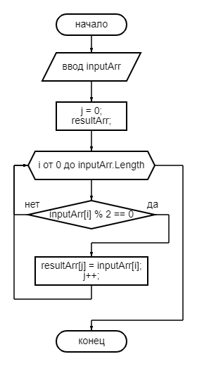

# Итоговая проверочная работа.

## Задача
Написать программу, которая из имеющегося массива целых чисел формирует массив из четных чисел. Первоначальный массив можно ввести с клавиатуры, либо сгенерировать случайным образом. При решении не рекомендуется пользоваться коллекциями, лучше обойтись исключительно массивами.

## Блок схема основного алгоритма


## Код основного алгоритма
```C#
int[] GetEvenArray(int[] inputArr)
{
    int[] resultArr = new int[inputArr.Length];
    int j = 0;
    for (int i = 0; i < inputArr.Length; i++)
        if (inputArr[i] % 2 == 0)
        {
            resultArr[j] = inputArr[i];
            j++;
        }
    Array.Resize(ref resultArr, j);
    return resultArr;
}
```

## Тесты
```
[1, 2, 3, 4] -> [2, 4]
[1, 3, 4, 5, 7, 1, 3] -> [4]
[2, -4, 6] -> [2, -4, 6]
[1, 3, 5] -> []
```